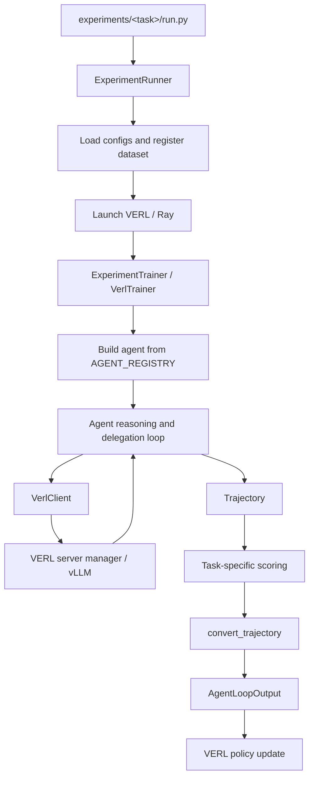

# AgentDaC

AgentDaC is a research framework for training recursive LLM agents with [VERL](https://github.com/volcengine/verl). Agents can solve tasks directly, reason across multiple turns, or delegate subproblems to fresh or persistent sub-agents.

The repository separates **task logic**, **agent protocols**, and **RL infrastructure**, allowing the same task to be trained with different decomposition and communication strategies.

## Repository Structure

```text
AgentDaC/
├── src/
│   ├── agents/                  # Agent implementations and output parsers
│   │   ├── dummy_agent/         # Direct-response baseline
│   │   ├── marker_agent/        # Marker-delimited task/answer protocol
│   │   ├── json_agent/          # JSON-structured actions
│   │   ├── regex_agent/         # Regex-guided actions
│   │   ├── perst_agent/         # Persistent recursive sub-agents
│   │   └── tool_agent/          # Native tool-call agents
│   ├── inference/               # Backend-independent inference clients
│   ├── configs/                 # Typed configuration models
│   ├── custom/                  # VERL dataset, conversion, and PPO extensions
│   ├── trainer.py               # Base VERL loop for one rollout
│   ├── trajectory.py            # Shared rollout and reward representation
│   └── utils/                   # Environment, logging, templates, and I/O
│
├── experiments/
│   ├── _framework/              # Shared runner, trainer, agent registry, and rewards
│   ├── math/
│   ├── easy2hard/
│   ├── bbeh/
│   ├── saturn/
│   ├── memorization/
│   └── chess/
│
├── config_files/
│   ├── prompts/                 # Reusable root, intermediate, and leaf prompts
│   └── templates/               # Model chat-template overrides
│
├── notebooks/                   # Data preparation, testing, and analysis
├── pyproject.toml
└── uv.lock
```

A task usually follows this layout:

```text
experiments/<task>/
├── run.py                       # CLI entry point
├── dataset.py                   # Dataset loading and filtering
├── format.py                    # Dataset row -> user prompt
├── rewards.py                   # Task-specific rewards
├── trainer.py                   # Prompt formatting and trajectory scoring
└── configs/
    └── <agent>/                 # Configuration for one task/agent combination
```

## System and Data Flow



The flow for one training sample is:

1. **`ExperimentRunner`** loads the task and agent configuration, merges `verl_config.json` over VERL's defaults, registers the dataset and agent loop, and launches training.
2. **`DynamicDataset`** loads the requested split inside the VERL worker, then applies deterministic shuffling, filtering, and sample limits.
3. **`VerlTrainer`** formats one dataset row, constructs the selected agent, and runs one complete rollout.
4. The agent calls the model through **`VerlClient`**, which applies the chat template and sends token IDs to VERL's vLLM-backed rollout engine.
5. All messages, model responses, rewards, metrics, and errors are stored in a **`Trajectory`**.
6. The task trainer parses the final answer and computes the trajectory reward.
7. **`convert_trajectory()`** converts the interaction into VERL training data while preserving the exact sampled token IDs.

The converted `AgentLoopOutput` contains:

* `prompt_ids`: tokens before the first assistant generation;
* `response_ids`: the remaining multi-turn interaction;
* `response_mask`: `1` for model-generated tokens and `0` for user, controller, tool, or returned sub-agent messages;
* `reward_score`: the final scalar trajectory reward.

This separation lets task correctness remain independent of the agent protocol.

## Main Components

| Component           | Responsibility                                                                                              |
| ------------------- | ----------------------------------------------------------------------------------------------------------- |
| `ExperimentRunner`  | CLI, config loading, dataset registration, chat-template validation, and VERL launch.                       |
| `VerlTrainer`       | Runs and scores one rollout, writes optional trajectory logs, and returns `AgentLoopOutput`.                |
| `ExperimentTrainer` | Shared task trainer that selects the agent and optionally randomizes decomposition budgets.                 |
| `BaseAgent`         | Common interface for agent implementations: `chat()`, `parse_answer()`, inference, and trajectory handling. |
| `Trajectory`        | Canonical record of the conversation, nested histories, reward, metrics, metadata, logs, and errors.        |
| `InferenceClient`   | Backend-independent inference interface, implemented by `VerlClient` and `OAIClient`.                       |
| `DynamicDataset`    | VERL-compatible dataset base class that loads task data inside workers.                                     |
| `CustomPPOTrainer`  | Adds aggregation of custom per-trajectory training and validation metrics.                                  |
| `TrajectoryWriter`  | Optionally writes complete rollouts as readable JSON files.                                                 |

## Agent Protocols

| Agent key         | Description                                                                                   |
| ----------------- | --------------------------------------------------------------------------------------------- |
| `dummy`           | Direct-response baseline without decomposition.                                               |
| `marker`          | Uses marker-delimited task and answer blocks and can delegate fresh sub-tasks.                |
| `json`            | Represents actions through structured JSON output.                                            |
| `regex`           | Uses guided regex output for constrained actions.                                             |
| `perst`           | Maintains a persistent current sub-agent across follow-up tasks.                              |
| `native_perst`    | Persistent agent designed for models with native reasoning followed by a guided action block. |
| `tool_stateless`  | Uses native tool calls and creates a fresh sub-agent for every task.                          |
| `tool_persistent` | Uses native tool calls and can continue with the current sub-agent.                           |
| `tool_submit`     | Persistent tool agent that returns its final answer through `submit_answer`.                  |

Supported agents are defined separately by each experiment's `run.py`.

## Quick Start

### Requirements

* Linux with an NVIDIA GPU;
* Python 3.12;
* [`uv`](https://docs.astral.sh/uv/);
* a CUDA 12.8-compatible environment.

The current environment pins PyTorch 2.10, vLLM 0.19.1, and VERL 0.8.0.

### Installation

```bash
git clone --branch verl-migration https://github.com/TheGuy42/AgentDaC.git
cd AgentDaC
uv sync
```

Create a `.env` file when the corresponding services are used:

```bash
HF_TOKEN=...
WANDB_API_KEY=...

# Only needed when using OAIClient directly:
OPENAI_API_KEY=...
```

### Minimal pipeline test

```bash
uv run python experiments/math/run.py \
    --agent marker \
    --gpus 0 \
    --test_run
```

### Standard run

```bash
uv run python experiments/math/run.py \
    --agent marker \
    --gpus 0 \
    --project math_marker \
    --run qwen3_marker \
    --traj_dir trajectories
```

Common arguments:

* `--agent`: agent protocol; required;
* `--gpus`: local GPU IDs;
* `--config_dir`: override `experiments/<task>/configs/<agent>`;
* `--resume`: resume from a VERL checkpoint;
* `--traj_dir`: enable full trajectory logging;
* `--seed`: experiment seed;
* `--silent`: reduce logging;
* `--test_run`: run a small end-to-end training test.

Use the task entry point for task-specific options:

```bash
uv run python experiments/chess/run.py --help
```

Validation is configured through `verl_config.json`. The shared runner currently does not provide a separate evaluation-only CLI mode.

## Active Experiments

| Experiment     | Task                                                  | Supported agents                                                            |
| -------------- | ----------------------------------------------------- | --------------------------------------------------------------------------- |
| `math`         | Hendrycks MATH, optionally filtered by level          | `dummy`, `marker`, `json`, `regex`, `perst`                                 |
| `easy2hard`    | Easy2Hard-Bench E2H-AMC, filtered by difficulty       | `marker`, `regex`                                                           |
| `bbeh`         | Selected BBEH benchmark tasks                         | `marker`                                                                    |
| `saturn`       | Local Saturn dataset                                  | `marker`                                                                    |
| `memorization` | Synthetic label-memorization task                     | `dummy`, `marker`, `perst`                                                  |
| `chess`        | Chess positions and puzzles with engine-based scoring | `perst`, `native_perst`, `tool_stateless`, `tool_persistent`, `tool_submit` |

## Configuration

Each task/agent combination normally contains:

```text
experiments/<task>/configs/<agent>/
├── train_config.json            # Dataset size limits
├── prompt_config.json           # Root, intermediate, and leaf prompts
├── decomp_config.json           # Depth, delegation, and round budgets
├── rollout_config.json          # Generation arguments by stage
├── verl_config.json             # Model, RL, vLLM, optimizer, FSDP, and logging
└── extra_config.json            # Optional agent- or task-specific settings
```

Some experiments add task-specific files. Chess configurations, for example, also include `chess_config.json` and `engine_config.json`.

The default config directory is:

```text
experiments/<task>/configs/<agent>
```

Pass `--config_dir` to use an alternative configuration.

## Outputs

When `--traj_dir <directory>` is supplied, trajectories are written under:

```text
<directory>/<project>/<run>/step_<step>/<train|val|test>/<rollout_id>.json
```

Each file contains the conversation, tool schemas, reward, metrics, metadata, logs, errors, and optional nested histories.

Training metrics use the loggers configured in `verl_config.json`, typically console and Weights & Biases. Custom trajectory metrics are aggregated under `train-custom/` and `val-custom/`.

## Extending the Repository

To add an experiment:

1. implement a `DynamicDataset`;
2. add prompt formatting and reward functions;
3. subclass `ExperimentTrainer`;
4. add an `ExperimentRunner` in `run.py`;
5. add configurations for each supported agent.

To add an agent protocol:

1. subclass `BaseAgent`;
2. implement `chat()`, `parse_answer()`, and `error_kinds()`;
3. add any required parser or tool schemas;
4. register the agent in `experiments/_framework/agents.py`.

## Implementation Notes

* Multi-turn conversion requires a prefix-preserving chat template. The runner validates or patches the effective template before training.
* Parent trajectories train only tokens generated directly by the parent agent. Returned sub-agent answers and tool/controller messages are context-only in that trajectory.
* Nested sub-agent histories can be logged but are not currently converted into additional VERL training spans.
* Training generation temperature must match VERL's rollout temperature so recomputed log-probabilities remain on-policy.

