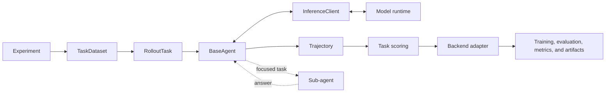

# AgentDaC

AgentDaC is a research framework for building, training, and evaluating recursive LLM
agents. It supports controlled experiments on task decomposition, multi-turn reasoning,
delegation, persistent sub-agents, and agentic reinforcement learning.

The framework separates agent behavior, task logic, inference, trajectories, and
execution backends. Tasks and agents can therefore be reused across different training
and inference systems without embedding backend-specific types in the core research code.

> **Status:** AgentDaC is research software under active development. APIs,
> configurations, agents, and backend integrations may change as the project evolves.

## Highlights

- Multiple decomposition and interaction protocols behind a shared agent interface.
- Recursive delegation bounded by depth, delegation count, and interaction rounds.
- Backend-independent datasets, tasks, scoring, agents, and trajectories.
- Training and inference integrations isolated at the edge of the framework.
- Typed structural configuration with explicit experiment-specific extension points.
- Canonical trajectory logging across backends.

## Quickstart

### Requirements

- Linux
- Python 3.12
- [`uv`](https://docs.astral.sh/uv/)
- An NVIDIA/CUDA environment for training backends
- Any task-specific dependency, such as a UCI engine for chess

Choose one backend environment from [Backends](#backends). Backend extras are
intentionally separate because their dependency stacks may be incompatible.

Run commands from the repository root. Checked-in prompt and chat-template paths are
repository-relative.

Create a `.env` file when the selected model, dataset, or logger requires credentials:

```dotenv
HF_TOKEN=...
WANDB_API_KEY=...
OPENAI_API_KEY=...
```

Run an experiment with:

```bash
uv run python experiments/<task>/run.py \
  --backend <backend> \
  --agent <agent> \
  --gpus 0
```

Add `--test_run` for a small backend-specific pipeline run:

```bash
uv run python experiments/<task>/run.py \
  --backend <backend> \
  --agent <agent> \
  --gpus 0 \
  --test_run
```

`--test_run` is intended for debugging, not representative experiments. Use an
experiment entry point to inspect all CLI options:

```bash
uv run python experiments/<task>/run.py --help
```

Common options include `--config_dir`, `--project`, `--run`, `--traj_dir`, `--seed`,
and `--log_level`.

## Architecture

AgentDaC is organized around a small set of contracts:

| Component | Responsibility |
| --- | --- |
| `TaskDataset` | Load task data and prepare deterministic train, validation, and test splits. |
| `RolloutTask` | Format a sample, run an agent, and score the completed trajectory. |
| `BaseAgent` | Define an interaction and delegation protocol. |
| `InferenceClient` | Generate responses without exposing runtime details to the agent. |
| `InferenceResponse` | Expose backend-neutral content, reasoning, tool calls, finish reason, and usage. |
| `Trajectory` | Preserve the rollout and its training or evaluation metadata. |
| Backend adapter | Assemble the runtime, execute rollouts, and optionally convert trajectories for training. |



For each sample, the selected backend prepares the dataset row, constructs the configured
agent, runs it through an `InferenceClient`, records a `Trajectory`, and delegates scoring
to the task. Answer evaluation can be shared across agents, while tasks may additionally
score formatting, protocol compliance, or decomposition behavior.

## Agents

Agent implementations are registered in `src/agents/registry.py`. A task-agent-backend
combination is runnable when the agent is registered, the experiment provides a matching
configuration directory, the selected backend files are present, and the model runtime
supports the required parsing or tool protocol.

| Agent key | Protocol |
| --- | --- |
| `dummy` | Single model response with no decomposition. |
| `marker` | Marker-delimited delegation and final-answer blocks; may issue multiple tasks per turn. |
| `json` | Guided JSON actions for thinking, delegation, and answering. |
| `regex` | Guided text actions constrained by a regular expression. |
| `perst` | Regex-guided interaction with a persistent current sub-agent. |
| `native_perst` | Persistent delegation for models with native reasoning output. |
| `tool_stateless` | Native tool calling with a fresh sub-agent for each delegation. |
| `tool_persistent` | Native tool calling with follow-up messages to the current sub-agent. |
| `tool_submit` | Persistent tool agent that terminates through `submit_answer`. |

Structured-output and tool agents depend on capabilities exposed by the active
`InferenceClient` and model runtime. Tool agents additionally require a compatible
client-side tool parser; models with separated reasoning output may require a reasoning
parser.

### Decomposition budget

Recursive agents share three limits:

- `max_depth`: maximum recursive nesting;
- `max_tasks`: delegations made by one agent invocation;
- `max_rounds`: non-terminal interaction rounds.

Round and task counters are local to each agent invocation. Child agents receive fresh
counters while their depth is incremented, so `max_tasks` is a per-agent branching budget
rather than a global tree-wide limit.

### Adding an agent

1. Subclass `BaseAgent`.
2. Implement `chat()`, `parse_answer()`, and `error_kinds()`.
3. Add any required action schema, parser, or tool definitions.
4. Register a builder in `src/agents/registry.py`.
5. Add experiment configurations for the intended task and backend combinations.

## Backends

Backends own framework integration rather than agent or task behavior. A backend loads
its native configuration, creates an `InferenceClient`, executes the shared rollout
contract, reports metrics, and—when applicable—converts trajectories for training.

| Backend | Purpose |
| --- | --- |
| [VERL](https://github.com/volcengine/verl) | Reinforcement-learning rollouts and training. |
| [ART](https://github.com/OpenPipe/ART) | Local rollout-group generation and training. |
| [vLLM](https://github.com/vllm-project/vllm) | Inference and evaluation against an existing OpenAI-compatible server. |

Choose exactly one backend extra per environment:

```bash
# VERL
uv sync --locked --extra verl --extra experiments

# ART
uv sync --locked --extra art --extra experiments

# vLLM-backed inference and evaluation
uv sync --locked --extra vllm --extra experiments
```

Backend configurations follow the convention:

```text
<backend>_config.yaml
<backend>_rollout_config.yaml
```

<details>
<summary><strong>VERL details</strong></summary>

The VERL adapter integrates AgentDaC with VERL's asynchronous agent loop and RL trainer.
It runs multi-turn rollouts through VERL's native token-generation API and converts
completed trajectories into token IDs and policy masks.

Sampled assistant tokens remain trainable. User, controller, tool, and returned sub-agent
tokens remain context but are excluded from the parent trajectory's policy mask.
Prefix-preserving chat templates are required for multi-turn span reconstruction.

Required files:

```text
verl_config.yaml
verl_rollout_config.yaml
```

</details>

<details>
<summary><strong>ART details</strong></summary>

The ART adapter generates rollout groups through a local ART model and passes scored
trajectories to ART's training backend. It can train on complete multi-turn trajectories
or split interactions into episodes through `train.train_episodes`.

Required files:

```text
art_config.yaml
art_rollout_config.yaml
```

</details>

<details>
<summary><strong>vLLM details</strong></summary>

The vLLM adapter is an inference-only runner for an already running OpenAI-compatible
server. It supports concurrent scored rollouts, repeated samples, trajectory logging,
aggregate metrics, and optional Weights & Biases reporting.

It does not launch `vllm serve` and does not train a model. Start the server separately
and configure its URL and model name in `vllm_config.yaml`.

Required files:

```text
vllm_config.yaml
vllm_rollout_config.yaml
```

</details>

### Adding a backend

1. Implement the backend interface under `experiments/_framework/backends/`.
2. Implement any runtime-specific `InferenceClient` or trajectory conversion under `src/backends/`.
3. Register the backend in the shared backend registry.
4. Keep framework-specific types out of core task, agent, inference, and trajectory contracts.

## Experiments

Each experiment owns its dataset adapter, prompt formatting, reward logic, task class,
entry point, and configuration directories.

| Experiment | Description |
| --- | --- |
| `math` | Hendrycks MATH problems filtered by difficulty level. |
| `easy2hard` | Easy2Hard-Bench AMC problems filtered by item difficulty. |
| `bbeh` | Selected BBEH reasoning tasks. |
| `saturn` | Boolean satisfiability problems from the local Saturn dataset. |
| `memorization` | Synthetic ID-to-label memorization. |
| `chess` | Legal move selection scored by a local UCI chess engine. |

```text
experiments/<task>/
  dataset.py
  format.py
  rewards.py
  task.py
  run.py
  configs/<agent>/
```

The available configuration directories are the practical source of truth for runnable
task-agent-backend combinations.

### Adding a task

1. Implement a `TaskDataset` that returns the available `RolloutStage` splits.
2. Implement a `RolloutTask` that formats samples and scores trajectories.
3. Add task-specific formatting and reward logic.
4. Create an entry point with `Experiment`.
5. Add shared and backend-specific configuration files.

Tasks that need additional typed configuration can subclass `Experiment` and override
`task_configs()`.

## Configuration

A configured task-agent combination normally contains:

```text
data_config.yaml       split sizes, seed, and task-specific dataset parameters
prompt_config.yaml     root, intermediate, and leaf prompts; optional tool definitions
decomp_config.yaml     recursive delegation budgets
extra_config.yaml      optional experiment and agent extension settings
```

The selected backend adds its own configuration files, and tasks may add typed
configuration of their own.

Structural configuration is strict by default. Explicit experimentation surfaces remain
extensible:

- `data_config.yaml` accepts dataset-specific loader parameters;
- `extra_config.yaml` is an untyped experiment and agent extension dictionary;
- backend-native configuration files preserve the selected framework's options;
- rollout `kwargs` accept generation arguments supported by the active client.

Rollout configuration supports shared arguments and stage-specific overrides:

```yaml
kwargs:
  max_tokens: 512
  temperature: 0.7

train_kwargs: {}

val_kwargs:
  temperature: 0.0

test_kwargs: {}
```

The selected stage dictionary overrides duplicate keys from `kwargs`.

## Trajectories and outputs

`Trajectory` is the canonical rollout record. It retains messages and model responses,
tool schemas and calls, optional nested histories (sub-agent trajectories), reward, metrics, metadata, logs,
structured errors, and timing.

Model responses remain distinct from controller-created messages, allowing backend
adapters to preserve which tokens came from the policy and which tokens are context.

Common metric conventions:

- `direct_*`: work performed by the current agent;
- `subtree_*`: work performed by the current agent and recursive descendants;
- `subtree_depth`: maximum recursive depth reached below the current agent;
- `direct_tokens`: the final prompt-plus-completion token count reported for the current
  agent's latest model turn.

`direct_tokens` approximates the complete direct conversation length. It is not the sum
of token processing across calls and does not include full recursive sub-agent histories.

Enable trajectory logging with `--traj_dir <directory>`. Files are written under:

```text
<traj_dir>/<backend>/<project>/<run>/step_<step>/<train|val|test>/<rollout_id>.json
```

## Repository layout

```text
AgentDaC/
  src/
    agents/                  agent protocols, actions, and parsers
    inference/               backend-neutral client interfaces
    running/                 dataset and rollout contracts
    backends/                runtime and training integrations
    configs/                 shared typed configuration
    utils/                   environment, I/O, logging, and visualization
    trajectory.py            canonical rollout representation
  experiments/
    _framework/              shared CLI and backend dispatch
    <task>/                   task implementation and configurations
  config_files/
    prompts/                 reusable agent prompts
    templates/               chat-template overrides
  pyproject.toml
```

Most research extensions should remain local to an agent directory, an experiment
directory, and their corresponding configurations. Backend code should change only when
integrating runtime-specific execution or trajectory conversion.

## Development status

AgentDaC is under active development. The pinned environments in `pyproject.toml` and
`uv.lock` are part of the supported setup because the backend stacks depend on specific
and sometimes incompatible versions.

Use `--test_run` to validate a selected experiment, agent, and backend pipeline before
launching a full experiment.

## License

This framework is released under the MIT License. See [LICENSE](LICENSE) for details.
