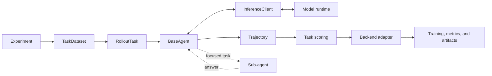

# AgentDaC

AgentDaC is a research framework for building, training, and evaluating recursive LLM
agents. It provides a common runtime for agents that can answer directly, reason across
multiple turns, delegate focused subproblems, and continue conversations with persistent
sub-agents.

The framework separates agent behavior, task logic, inference, and training
infrastructure. An experiment can therefore change its agent protocol or execution
backend without rewriting its dataset, prompt formatting, reward function, or trajectory
representation.

## Supported backends

- [VERL](https://github.com/volcengine/verl) — reinforcement-learning rollouts and
  training.
- [ART](https://github.com/OpenPipe/ART) — local rollout-group generation and training.
- [vLLM](https://github.com/vllm-project/vllm) — inference and evaluation against a
  running OpenAI-compatible server; no training.

Backend adapters are deliberately kept at the edge of the project. Agents and tasks use
the same interfaces regardless of which backend executes them. See [Backends](#backends)
for installation, configuration, and execution details.

## Key capabilities

- **Multiple agent protocols.** Compare direct response, marker-delimited actions,
  guided JSON or regex output, persistent delegation, and native tool calling.
- **Recursive delegation.** Bound agent trees by depth, delegation count, and interaction
  rounds.
- **Backend-independent tasks.** Keep dataset loading, prompt construction, answer
  parsing, and reward computation separate from the trainer.
- **Canonical trajectories.** Record messages, raw model responses, nested histories,
  rewards, metrics, metadata, logs, tools, and errors in one representation.
- **Typed configuration.** Validate structural configuration while preserving explicit
  extension points for datasets and backend-native arguments.
- **Reproducible experiment structure.** Reuse the same runner, configuration layout,
  trajectory logging, and task contract across experiments.

## Design

AgentDaC is organized around a small set of contracts:

| Component | Responsibility |
| --- | --- |
| `TaskDataset` | Load task data and prepare deterministic train, validation, and test splits. |
| `RolloutTask` | Format a sample, run an agent, and score the completed trajectory. |
| `BaseAgent` | Define an interaction and delegation protocol. |
| `InferenceClient` | Generate a model response without exposing backend details to the agent. |
| `InferenceResponse` | Provide a backend-neutral view of content, reasoning, tool calls, finish reason, and usage. |
| `Trajectory` | Preserve the complete rollout and its training/evaluation metadata. |
| Backend adapter | Assemble the runtime, execute rollouts, and optionally convert trajectories for training. |



### Rollout lifecycle

For each sample, the selected backend:

1. obtains a prepared row from the experiment's `TaskDataset`;
2. asks the `RolloutTask` to format the user prompt;
3. constructs the configured agent through the agent registry;
4. runs the agent against an `InferenceClient`, including any recursive delegation;
5. records the interaction as a `Trajectory`;
6. lets the task parse the final answer and compute rewards and metrics;
7. logs, evaluates, or trains on the result according to the backend.

Task correctness does not depend on how the agent arrived at its answer. This makes it
possible to compare agent protocols without duplicating task implementations.

## Agent protocols

Agent builders are registered in `src/agents/registry.py`. An experiment chooses which
of them it supports in its `run.py`.

| Agent key | Protocol |
| --- | --- |
| `dummy` | Single model response with no decomposition. |
| `marker` | Delegation and final answers expressed with marker-delimited blocks. |
| `json` | Guided JSON actions for thinking, delegation, and answering. |
| `regex` | Guided text actions constrained by a regular expression. |
| `perst` | Regex-guided agent with a persistent current sub-agent. |
| `native_perst` | Persistent agent designed for models with native reasoning output. |
| `tool_stateless` | Native tool calling with a fresh sub-agent for each delegation. |
| `tool_persistent` | Native tool calling with follow-up messages to the current sub-agent. |
| `tool_submit` | Persistent tool agent that terminates through `submit_answer`. |

All recursive protocols use the same decomposition budget:

- `max_depth` limits nesting;
- `max_tasks` limits delegations made by one agent invocation;
- `max_rounds` limits non-terminal interaction rounds.

## Experiments

The repository includes several research tasks:

| Experiment | Description |
| --- | --- |
| `math` | Hendrycks MATH problems filtered by difficulty level. |
| `easy2hard` | Easy2Hard-Bench AMC problems filtered by item difficulty. |
| `bbeh` | Selected BBEH reasoning tasks. |
| `saturn` | Boolean satisfiability problems from the local Saturn dataset. |
| `memorization` | Synthetic ID-to-label memorization. |
| `chess` | Legal move selection scored by a local UCI chess engine. |

Each experiment owns its dataset adapter, prompt formatting, reward logic, task class,
entry point, and configuration directories:

```text
experiments/<task>/
  dataset.py
  format.py
  rewards.py
  task.py
  run.py
  configs/<agent>/
```

The experiment's `run.py` is the source of truth for its supported agents. Backend
support also depends on which backend-specific files are present in the selected
configuration directory.

## Getting started

### Requirements

- Linux;
- Python 3.12;
- [`uv`](https://docs.astral.sh/uv/);
- an NVIDIA/CUDA environment for the training backends;
- any task-specific external dependency, such as a UCI engine for chess.

### Install an environment

Choose exactly one backend extra. Backend extras are intentionally mutually exclusive;
use separate environments when working with more than one trainer stack. The
`experiments` extra installs dependencies used by the checked-in tasks.

```bash
# VERL training
uv sync --extra verl --extra experiments

# ART training
uv sync --extra art --extra experiments

# vLLM-backed inference and evaluation
uv sync --extra vllm --extra experiments
```

Run commands from the repository root. Prompt and chat-template paths in the checked-in
configuration are repository-relative.

### Environment variables

Create a `.env` file when the selected model, dataset, or logger requires credentials:

```dotenv
HF_TOKEN=...
WANDB_API_KEY=...
OPENAI_API_KEY=...
```

Only configure credentials used by your environment. Local OpenAI-compatible servers do
not normally require a real OpenAI API key.

### Run an experiment

The shared command shape is:

```bash
uv run python experiments/<task>/run.py \
  --backend <verl|art|vllm> \
  --agent <agent> \
  --gpus 0
```

For example, a small VERL pipeline run is:

```bash
uv run python experiments/math/run.py \
  --backend verl \
  --agent marker \
  --gpus 0 \
  --test_run
```

Use the experiment entry point to see its exact agent choices and common options:

```bash
uv run python experiments/chess/run.py --help
```

Common options include:

| Option | Purpose |
| --- | --- |
| `--agent` | Select the agent protocol; required. |
| `--backend` | Select `verl`, `art`, or `vllm`. If omitted, detect an installed backend. |
| `--gpus` | Select visible local GPU IDs. |
| `--config_dir` | Override `experiments/<task>/configs/<agent>`. |
| `--project` | Set the logging project name. |
| `--run` | Set the run name. |
| `--traj_dir` | Enable full trajectory JSON logging below this directory. |
| `--seed` | Set the experiment seed. |
| `--log_level` | Set logging level. |
| `--test_run` | Apply small backend-specific smoke-run settings. |

Passing `--backend` explicitly is recommended when an environment exposes more than one
supported package.

## Configuration

A configured task/agent combination normally contains the following shared files:

```text
data_config.yaml       split sizes, seed, and task-specific dataset parameters
prompt_config.yaml     root, intermediate, and leaf system prompts
decomp_config.yaml     recursive delegation budgets
extra_config.yaml      optional experiment and agent extension settings
```

It then adds the files required by its backend:

```text
<backend>_rollout_config.yaml
<backend>_config.yaml
```

For VERL these are `verl_rollout_config.yaml` and `verl_config.yaml`; the ART and vLLM
names follow the same pattern. Tasks may add typed configuration of their own. Chess, for
example, adds `chess_config.yaml` and `engine_config.yaml`.

### Validation and extension points

Structural configuration is strict: unknown fields in prompt, decomposition, rollout,
runner, ART training, and chess configuration raise validation errors. Numeric budgets
and resource counts are also validated at load time.

The places intended for experimentation remain extensible:

- `data_config.yaml` accepts dataset-specific loader parameters;
- `extra_config.yaml` is an untyped experiment/agent extension dictionary;
- `verl_config.yaml` is merged over VERL's native configuration;
- rollout `kwargs` dictionaries accept backend generation arguments;
- ART model configuration accepts backend-native fields.

### Stage-specific generation

Rollout configuration contains a shared argument dictionary plus optional stage-specific
overrides:

```yaml
kwargs:
  max_tokens: 512
  temperature: 0.7
train_kwargs: {}
val_kwargs:
  temperature: 0.0
test_kwargs: {}
```

The selected stage dictionary overrides `kwargs`. The final arguments are passed through
the active `InferenceClient`.

## Trajectories and outputs

`Trajectory` is the canonical record of a rollout. It retains:

- messages and model responses in order;
- tool schemas and tool calls;
- optional nested sub-agent histories;
- scalar reward and custom metrics;
- task metadata;
- controller logs and structured errors;
- rollout timing.

Model responses remain distinct from controller-created messages, allowing backend
adapters to preserve which tokens came from the policy and which tokens are context.

Passing `--traj_dir <directory>` writes readable JSON files under:

```text
<traj_dir>/<backend>/<project>/<run>/step_<step>/<train|val|test>/<rollout_id>.json
```

Trajectory logging is optional and uses the same format across backends.

## Backends

The backend layer owns framework integration, not agent or task behavior. A backend
loads its native configuration, creates an `InferenceClient`, executes the shared
rollout contract, reports metrics, and—when applicable—converts trajectories into
training data.

### VERL

The VERL adapter integrates AgentDaC with VERL's asynchronous agent loop and RL trainer.
It constructs datasets inside the worker, runs multi-turn rollouts through VERL's token
generation API, and converts completed trajectories into token IDs and policy masks.

The conversion preserves the sampled assistant token IDs. Tokens introduced by users,
controllers, tools, and returned sub-agent messages are retained as context but excluded
from the parent trajectory's policy mask. Prefix-preserving chat templates are validated
before training because multi-turn span reconstruction depends on that property.

Required files:

```text
verl_config.yaml
verl_rollout_config.yaml
```

### ART

The ART adapter generates rollout groups through a local ART model and passes scored
trajectories to ART's training backend. It can train on a complete multi-turn trajectory
or split the interaction into episodes, according to `train.train_episodes`.

Required files:

```text
art_config.yaml
art_rollout_config.yaml
```

Example:

```bash
uv run python experiments/memorization/run.py \
  --backend art \
  --agent dummy \
  --gpus 0 \
  --test_run
```

### vLLM

The vLLM adapter is an inference-only runner for an already running
OpenAI-compatible server. It supports concurrent scored rollouts, repeated samples,
trajectory logging, aggregate metrics, and optional Weights & Biases reporting. It does
not launch `vllm serve` and does not train a model.

Required files:

```text
vllm_config.yaml
vllm_rollout_config.yaml
```

Example:

```bash
uv run python experiments/chess/run.py \
  --backend vllm \
  --agent tool_submit \
  --gpus 0 \
  --test_run
```

`vllm_config.yaml` specifies the server URL and model name, requested dataset splits,
group size, concurrency, client-side tool parser, and optional reasoning parser.

## Repository layout

```text
AgentDaC/
  src/
    agents/                  agent protocols, actions, and parsers
    inference/               backend-neutral client interfaces
    running/                 dataset and rollout contracts
    backends/
      verl/                  VERL integration and trajectory conversion
      art/                   ART loading, conversion, and training
      vllm/                  inference-only runner
    configs/                 shared typed configuration
    utils/                   environment, I/O, logging, and visualization
    trajectory.py            canonical rollout representation
  experiments/
    _framework/              shared CLI and backend dispatch
    <task>/                   task implementation and configurations
  config_files/
    prompts/                 reusable agent prompts
    templates/               chat-template overrides
  pyproject.toml
```

## Extending AgentDaC

### Add a task

1. Implement a `TaskDataset` that returns the available `RolloutStage` splits.
2. Implement a `RolloutTask` that formats samples and scores trajectories.
3. Add task-specific formatting and reward functions.
4. Create an experiment entry point declaring its supported agents.
5. Add shared configuration and the required files for each supported backend.

### Add an agent protocol

1. Subclass `BaseAgent`.
2. Implement `chat()`, `parse_answer()`, and `error_kinds()`.
3. Add any action schema, parser, or tool definitions required by the protocol.
4. Register an agent builder in `src/agents/registry.py`.

### Add a backend

1. Implement the experiment backend interface under `experiments/_framework/backends/`.
2. Implement any runtime client or trajectory conversion under `src/backends/`.
3. Register the backend with the shared backend registry.
4. Keep framework-specific types out of the core task, agent, and trajectory contracts.

## Development

Run tests with the environment for the backend being developed:

```bash
uv run pytest
```

The test suite includes CPU-only coverage for agent parsing and control flow,
configuration validation, chat-template behavior, and chess evaluation components.

AgentDaC is research software under active development. Configuration formats and
backend integrations may evolve as the underlying training frameworks change.
